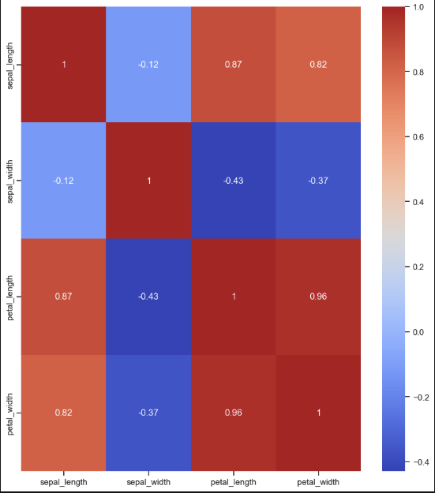

# 🌸 Iris Species: Exploratory Data Analysis (EDA)

This repository contains a comprehensive exploratory data analysis of the famous **Iris Dataset**. The goal of this project is to uncover the underlying patterns between different iris species using statistical methods and high-quality visualizations.

## 🚀 Project Overview
In this study, I processed the raw data to understand how sepal and petal measurements vary across three species: *Setosa*, *Versicolor*, and *Virginica*. 

### Key Objectives:
- **Data Cleaning:** Standardizing column names and handling species labels.
- **Statistical Profiling:** Calculating group-based mean, median, and standard deviation.
- **Visual Exploration:** Using distribution plots and heatmaps to identify key features.

## 📊 Key Insights & Visualizations
The analysis reveals that **Petal Length** and **Petal Width** are the most significant differentiators for species classification.
- **Setosa** is easily identifiable with significantly smaller petal dimensions.
- **Versicolor** and **Virginica** show slight overlaps but remain distinguishable through petal width correlations.

## 🛠 Tech Stack
- **Language:** Python
- **Libraries:** - `Pandas` (Data manipulation)
  - `NumPy` (Numerical operations)
  - `Seaborn` & `Matplotlib` (Data visualization)

## 📁 Repository Structure
- `iris-data-analysis.ipynb`: The main Jupyter Notebook containing all the code and insights.
- `iris.csv`: The raw dataset used for the analysis.

---
*“The goal is to turn data into information, and information into insight.”*
